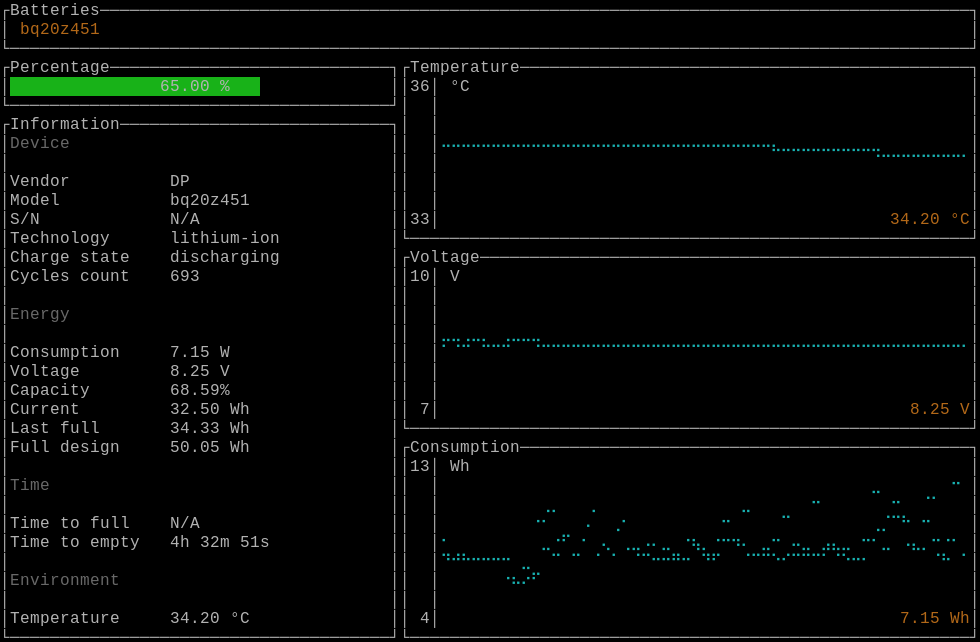

# batmon

[](https://crates.io/crates/batmon)


`batmon` is an interactive viewer, similar to `top`, `htop` and other *top utilities, but about the batteries installed in your notebook.

It was forked of <https://github.com/svartalf/rust-battop>.



## Features

- Cross-platform (Linux, MacOS, FreeBSD and DragonflyBSD are supported and Windows is untested)
- Supports multiple batteries in case your notebook have them
- It is free
- Usually it just works!

`batmon` is backed by a Rust crate [battery](https://crates.io/crates/starship_battery) which provides unified cross-platform information about system batteries.
[Check it out](https://github.com/starship/rust-battery), if you want to gather the same information for your application!

## Installation

[](https://repology.org/project/batmon/versions)

### Arch linux

Install package from [AUR](https://aur.archlinux.org/packages/batmon/) with your favorite AUR helper:

```sh
yay -S batmon
```

### From sources

Clone the repo and run

```sh
cargo build --release
```

## Usage

Simply running the `batmon` command in your terminal should do the thing.

Left and right arrows can be used to switch between different system batteries (if available).

Run the `batmon -h` command to see the additional available options.
